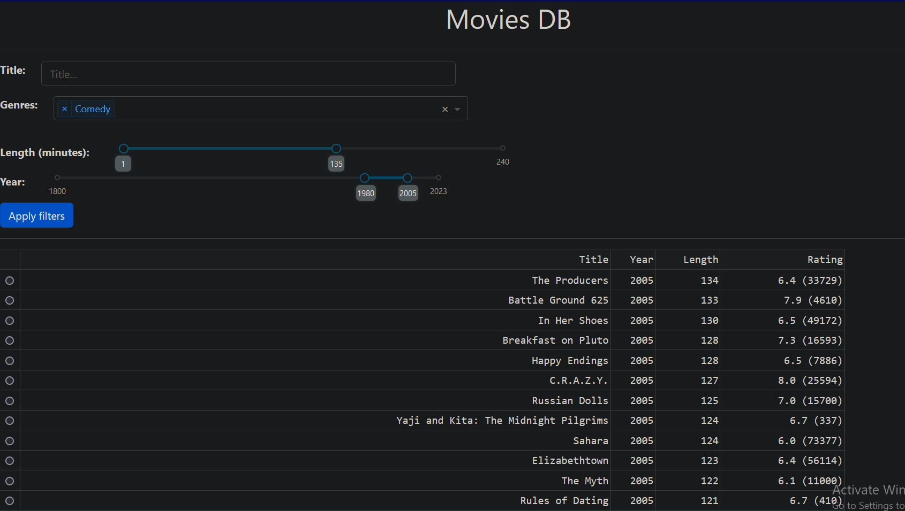
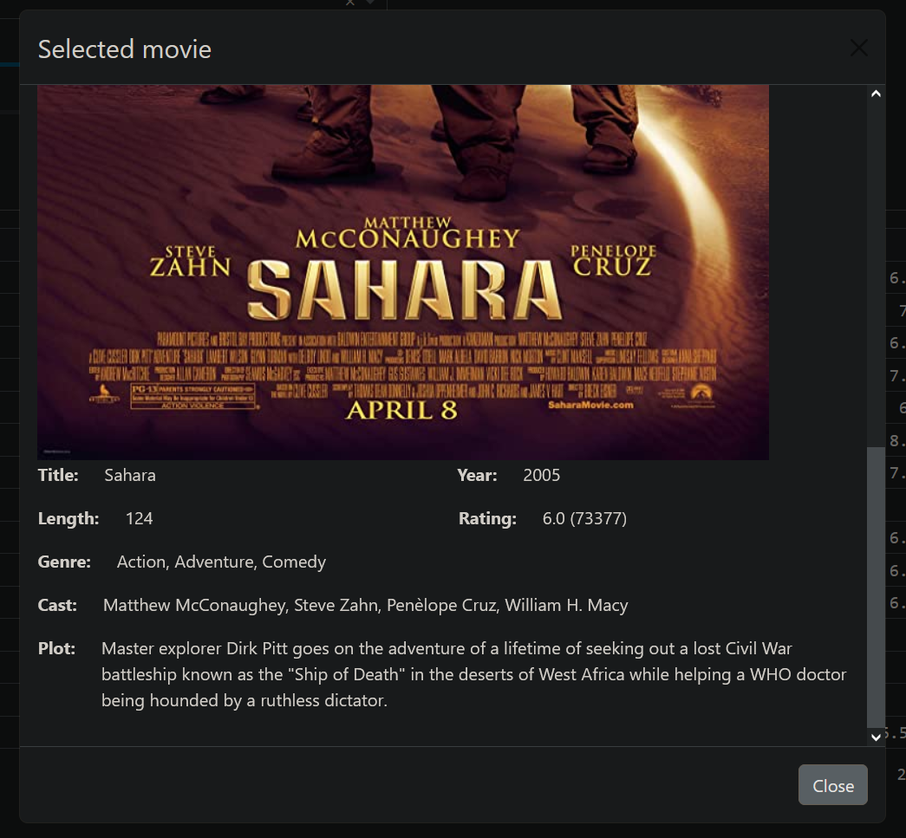
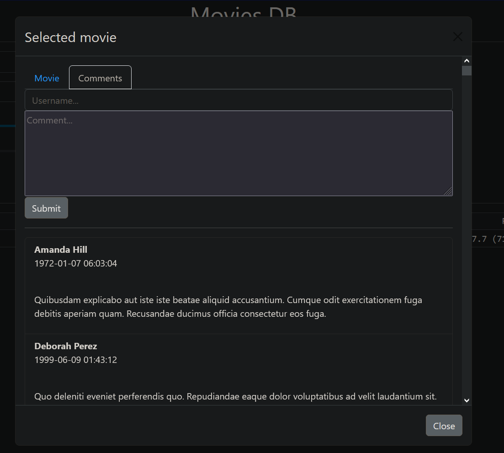

# movies-app

A very simple movies database app built with MongoDB, Python (Flask and Plotly Dash), Docker and Kubernetes.  

The app has two components:  

* frontend  
  A GUI built with Plotly Dash that lets users search for movies using various filters. Users can also select a movie and view some information about it such as its full title, cast and plot summary. Comments are also available while viewing a movie  
* backend  
  An HTTP server built with Flask that serves the movies data stored in a MongoDB database

The two components are built into Docker images and deployed to a Kubernetes cluster.  

## Purpose of the app

Since the idea behind this app is containerising and deploying and application to a Kubernetes cluster, the app itself is very simple and involves some compomises. For example, both components are deployed as microservices running "development" servers which are not at all suitable for production environments  

## What the app looks like

The app's homepage has a few filters such as genres and movie length (in minutes). They are followed by a table of movies matching the filters.  

  

A movie from the table can be selected and viewed, showing its poster and various information such as it title, year, cast and plot summary.  

    

The **Comments** tab makes it possible to view comments and submit new ones.  

  

## Project structure

This repository consists of:

* *frontend* and *backend*  
  Directories containing various resources for each component of the app. These include the source code, scripts for running the components locally and Docker related files, including example **docker** commands
* *data*  
  JSON files containing example data used by the app. These can be imported into a MongoDB deployment
* *iac*  
  Definition files used to deploy the app to a Kubernetes cluster. There is also a Markdown file containing example commands for the deployment

